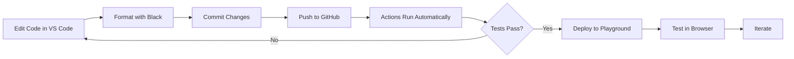

# Suffolk LIT Lab Assembly Line Workflow Guide

Complete guide for developing docassemble interviews using Suffolk LIT Lab's Assembly Line framework with VS Code and GitHub.

---

## 🎯 Overview

You're now set up to use the complete **Suffolk LIT Lab Assembly Line** development workflow:

- **VS Code** - Your development environment
- **GitHub** - Version control and automation
- **Assembly Line Actions** - Automated testing and deployment
- **Docassemble** - Interview platform
- **ALKiln** - End-to-end testing

---

## 📦 Installed GitHub Actions

Your repository now has these workflows configured:

### 1. **Assembly Line Build and Test** (`assembly_line_build.yml`)
Runs on every push and pull request.

**What it does:**
- ✅ Builds the docassemble package
- ✅ Validates Python code
- ✅ Runs unit tests
- ✅ Checks code formatting (Black)
- ✅ Validates docstrings
- ✅ Validates DOCX Jinja2 templates
- ✅ Runs ALKiln end-to-end tests

### 2. **Playground Deploy** (`playground_deploy.yml`)
Deploys to your docassemble playground for testing.

**What it does:**
- 🚀 Installs package to playground
- 🚀 Lets you test changes interactively
- 🚀 Useful for development branches

**Triggers:**
- Push to `main`, `dev`, or `feature/*` branches
- Manual trigger via GitHub Actions

### 3. **Word Document Diff** (`word_diff.yml`)
Reviews changes to Word documents in pull requests.

**What it does:**
- 📄 Converts DOCX to markdown
- 📄 Shows readable diffs
- 📄 Creates HTML comparison reports

**Triggers:**
- Pull requests modifying `.docx` files
- Manual trigger

### 4. **Server Health Monitor** (`server_monitor.yml`)
Monitors your docassemble server.

**What it does:**
- 🏥 Checks all interviews load
- 🏥 Runs twice daily (6 AM & 6 PM)
- 🏥 Optional email alerts

**Schedule:**
- 6:00 AM and 6:00 PM (automatic)
- Manual trigger available

---

## 🛠️ VS Code Setup

### Installed Extensions

Your VS Code is configured with:

**Gherkin/Cucumber:**
- `alexkrechik.cucumberautocomplete` - Autocomplete for .feature files
- `stevejpurves.cucumber` - Syntax highlighting

**Python:**
- `ms-python.python` - Python support
- `ms-python.vscode-pylance` - Language server
- `ms-python.black-formatter` - Code formatting

**YAML:**
- `redhat.vscode-yaml` - YAML support

**Git:**
- `eamodio.gitlens` - Enhanced git features
- `github.vscode-pull-request-github` - PR management

**Quality:**
- `charliermarsh.ruff` - Fast linter
- `streetsidesoftware.code-spell-checker` - Spell check

### Available Tasks (Ctrl+Shift+P → "Tasks: Run Task")

1. **Run Black Formatter** - Format Python code
2. **Check Black Formatting** - Verify formatting
3. **Run Python Unit Tests** - Run tests locally
4. **Git: Push to GitHub** - Push changes
5. **Git: Commit and Push** - Commit with message and push
6. **Open GitHub Actions** - View workflow runs
7. **Open Docassemble Server** - Open your server
8. **Deploy to Playground (Manual)** - Trigger deployment

---

## 🔄 Development Workflow

### Daily Development Flow



### Step-by-Step

#### 1. **Edit Your Code in VS Code**

```bash
# Open in VS Code
code /root/docassemble-alkiln-tests
```

**Edit files:**
- `docassemble/alkilntests/data/questions/*.yml` - Interview files
- `docassemble/alkilntests/data/sources/*.feature` - Test files
- `docassemble/alkilntests/data/templates/*.docx` - Document templates

#### 2. **Format Your Code**

In VS Code:
- Press `Ctrl+Shift+P`
- Type "Tasks: Run Task"
- Select "Run Black Formatter"

Or run manually:
```bash
black docassemble/
```

#### 3. **Run Tests Locally** (Optional)

```bash
# Run unit tests
python -m unittest discover

# Check formatting
black --check docassemble/
```

#### 4. **Commit and Push**

In VS Code:
- Press `Ctrl+Shift+P`
- Type "Tasks: Run Task"
- Select "Git: Commit and Push"
- Enter commit message

Or use git commands:
```bash
git add .
git commit -m "Add new interview feature"
git push
```

#### 5. **Watch Actions Run**

Go to: https://github.com/jswizzle3737/docassemble-alkiln-tests/actions

You'll see:
- ✅ Build and validate
- ✅ Python tests
- ✅ Format check
- ✅ DOCX validation
- ✅ ALKiln tests
- 🚀 Playground deployment

#### 6. **Test in Playground**

After deployment:
1. Go to: https://docassemble-uugcj-u59651.vm.elestio.app:443/
2. Login
3. Go to **Playground**
4. Your project is installed and ready to test!

---

## 🎯 Common Workflows

### Creating a New Interview

```bash
# 1. Create interview file
touch docassemble/alkilntests/data/questions/my_new_interview.yml

# 2. Edit in VS Code (autocomplete enabled)
code docassemble/alkilntests/data/questions/my_new_interview.yml

# 3. Create test file
touch docassemble/alkilntests/data/sources/my_new_interview_test.feature

# 4. Write tests
code docassemble/alkilntests/data/sources/my_new_interview_test.feature

# 5. Commit and push
git add .
git commit -m "Add new interview: my_new_interview"
git push

# 6. Actions run automatically
# 7. Check playground for deployment
```

### Creating a PDF Form

```bash
# 1. Create DOCX template
# Save to: docassemble/alkilntests/data/templates/my_form.docx

# 2. Add Jinja2 variables in Word
# Example: {{ users[0].name.full() }}

# 3. Create interview that uses template
# In your .yml file:
---
objects:
  - my_form: ALDocument.using(
      title="My Form",
      filename="my_form",
      enabled=True
    )
---

# 4. Push to GitHub
# Actions will validate Jinja2 syntax automatically!

# 5. Write PDF tests
# See pdf_tests.feature for examples
```

### Updating Assembly Line Package

```bash
# 1. Pull latest Assembly Line
# In your yml file:
include:
  - docassemble.AssemblyLine:assembly_line.yml

# 2. Use Assembly Line objects
objects:
  - users: ALPeopleList.using(ask_number=True)
  - other_parties: ALPeopleList.using(ask_number=True)

# 3. Test locally in playground
# 4. Write comprehensive tests
# 5. Push and deploy
```

---

## 🔐 Required GitHub Secrets

Make sure these are configured:

| Secret | Purpose |
|--------|---------|
| `SERVER_URL` | Your docassemble server address |
| `DOCASSEMBLE_DEVELOPER_API_KEY` | API authentication for deployment |

**To add more secrets:**
1. Go to: https://github.com/jswizzle3737/docassemble-alkiln-tests/settings/secrets/actions
2. Click "New repository secret"
3. Add name and value
4. Click "Add secret"

**Note:** The project name (`alkilntests`) is configured directly in the workflow.

---

## 📋 Action Reference

### SuffolkLITLab/ALActions

All actions use: `SuffolkLITLab/ALActions/{action_name}@main`

| Action | Purpose | When It Runs |
|--------|---------|--------------|
| `da_build` | Build & validate package | Every push/PR |
| `pythontests` | Run unit tests | Every push/PR |
| `black-formatting` | Check/fix code style | Every push/PR |
| `docsig` | Validate docstrings | Every push/PR |
| `valid_jinja2` | Validate DOCX templates | Every push/PR |
| `da_playground_install` | Deploy to playground | Push to main/dev |
| `word_diff` | Diff Word docs | PR with DOCX changes |
| `hall_monitor` | Check server health | Scheduled (2x daily) |

### SuffolkLITLab/ALKiln

ALKiln tests use: `SuffolkLITLab/ALKiln@v5`

**Purpose:** End-to-end testing of interviews
**When:** Every push/PR after build succeeds

---

## 🧪 Testing Strategy

### Test Pyramid

```
         /\
        /  \  Unit Tests (Python)
       /____\
      /      \  Integration Tests (ALKiln)
     /________\
    /          \  Manual Testing (Playground)
   /__________\
```

### What to Test Where

**Unit Tests** (`tests/` directory):
- Python functions
- Data validation
- Utility functions
- Business logic

**ALKiln Tests** (`.feature` files):
- Interview flow
- User interactions
- PDF generation
- Form completion
- Branching logic

**Manual Testing** (Playground):
- User experience
- Visual appearance
- Edge cases
- Real-world scenarios

---

## 📊 Monitoring and Debugging

### View Workflow Results

**GitHub Actions Dashboard:**
https://github.com/jswizzle3737/docassemble-alkiln-tests/actions

**What to check:**
- ✅ Green checkmark = all tests passed
- ❌ Red X = something failed
- 🟡 Yellow dot = in progress

### Debugging Failed Tests

1. **Click on failed workflow**
2. **Click on failed job**
3. **Expand failed step**
4. **Read error message**

**Common issues:**
- **Format errors:** Run Black formatter
- **Test failures:** Check ALKiln test syntax
- **DOCX errors:** Validate Jinja2 syntax in templates
- **Build errors:** Check Python syntax

### Artifacts

Some actions create artifacts (downloadable files):

- **Jinja2 Validation:** HTML reports of template errors
- **Word Diff:** Side-by-side comparisons
- **ALKiln Tests:** Screenshots of failed tests

**Download from:**
Actions page → Click workflow → Scroll to "Artifacts" section

---

## 🚀 Deployment Options

### Option 1: Playground (Development)

**Use for:** Testing, development, feature branches

**Triggers:**
- Automatic on push to `main`/`dev`/`feature/*`
- Manual via Actions tab

**Access:** Your playground in docassemble

### Option 2: Server-Wide Install (Production)

**For production deployment, add this workflow:**

```yaml
# .github/workflows/production_deploy.yml
name: Deploy to Production

on:
  release:
    types: [published]

jobs:
  deploy:
    runs-on: ubuntu-latest
    steps:
      - uses: actions/checkout@v4
      - uses: SuffolkLITLab/ALActions/da_package@main
        with:
          SERVER_URL: ${{ secrets.PROD_SERVER_URL }}
          DOCASSEMBLE_DEVELOPER_API_KEY: ${{ secrets.PROD_API_KEY }}
```

---

## 📚 Additional Resources

### Suffolk LIT Lab
- **Assembly Line:** https://github.com/SuffolkLITLab/docassemble-AssemblyLine
- **ALKiln:** https://github.com/SuffolkLITLab/ALKiln
- **ALActions:** https://github.com/SuffolkLITLab/ALActions
- **Documentation:** https://suffolklitlab.org/docassemble-AssemblyLine-documentation/

### Your Repository
- **Actions:** https://github.com/jswizzle3737/docassemble-alkiln-tests/actions
- **Settings:** https://github.com/jswizzle3737/docassemble-alkiln-tests/settings
- **Pull Requests:** https://github.com/jswizzle3737/docassemble-alkiln-tests/pulls

### Docassemble
- **Server:** https://docassemble-uugcj-u59651.vm.elestio.app:443/
- **Docs:** https://docassemble.org/docs.html
- **Forum:** https://docassemble.org/docs/support.html

---

## ✅ Quick Reference

### VS Code Tasks (Ctrl+Shift+P → Tasks)
- Run Black Formatter
- Run Python Unit Tests
- Git: Commit and Push
- Deploy to Playground

### Git Commands
```bash
git status              # Check status
git add .               # Stage all changes
git commit -m "msg"     # Commit
git push                # Push to GitHub
git pull                # Pull updates
```

### Python Commands
```bash
black docassemble/      # Format code
python -m unittest      # Run tests
```

### GitHub URLs
- **Actions:** /actions
- **Settings:** /settings
- **Secrets:** /settings/secrets/actions

---

## 🎉 You're All Set!

Your complete Suffolk LIT Lab workflow is configured:

✅ VS Code with extensions
✅ GitHub Actions with ALActions
✅ Automated testing (Python + ALKiln)
✅ Automatic deployment to playground
✅ Code quality checks
✅ DOCX template validation
✅ Server health monitoring

**Start developing Assembly Line interviews with confidence!** 🚀
